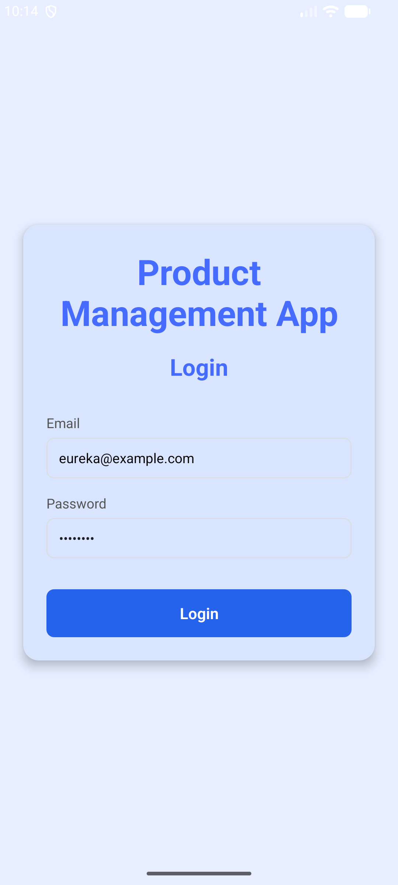
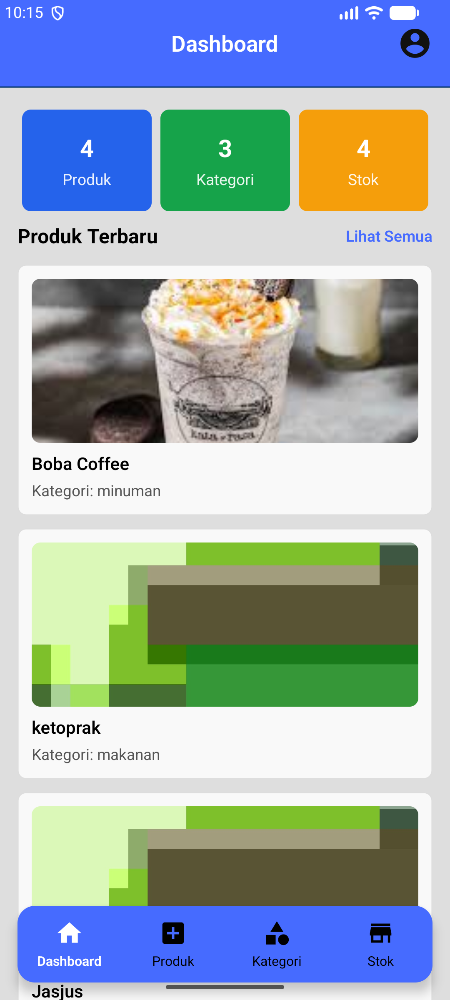
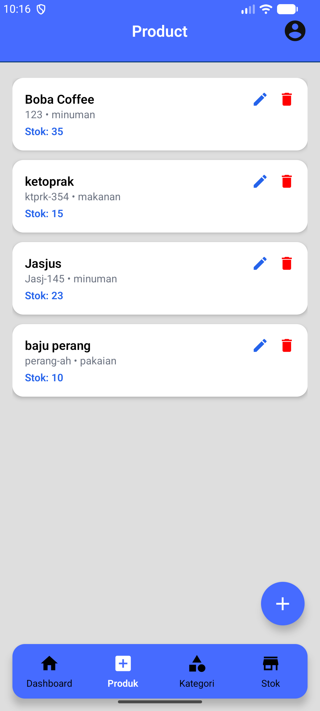
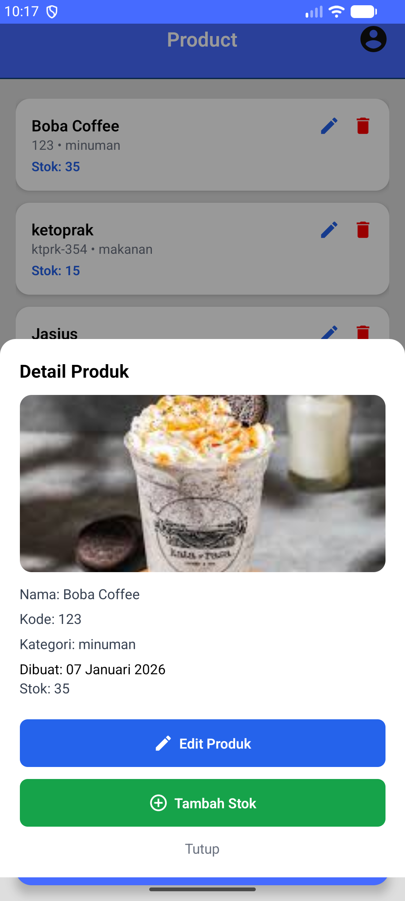
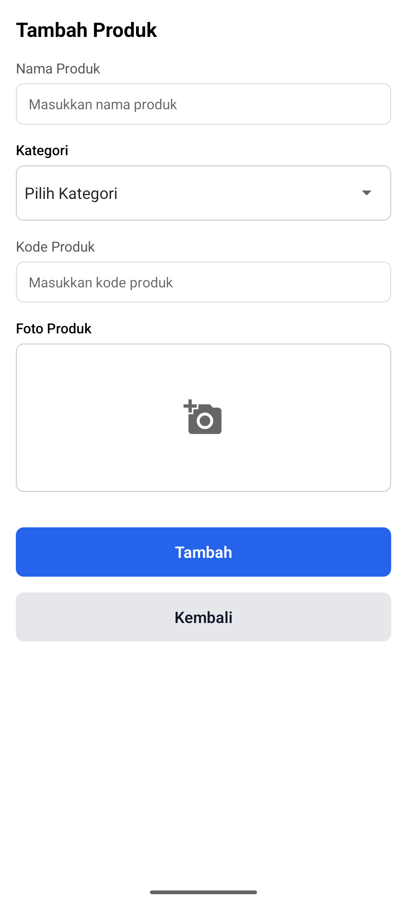
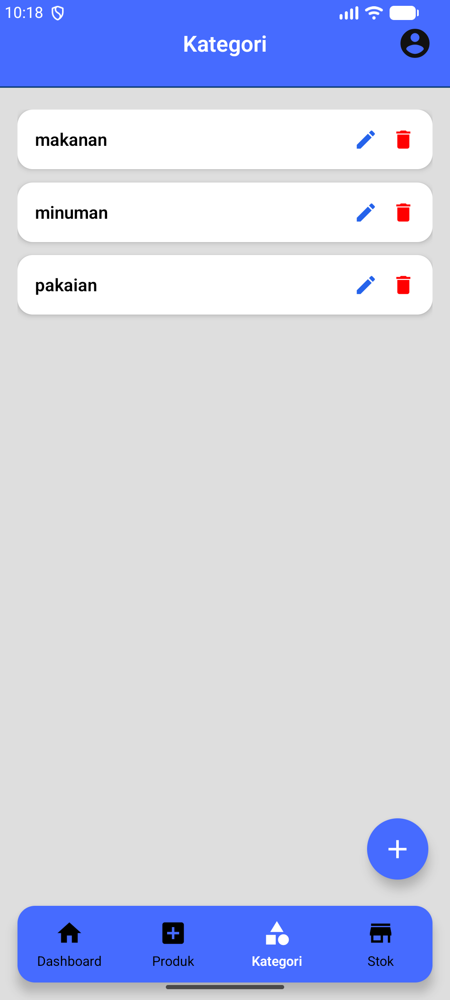
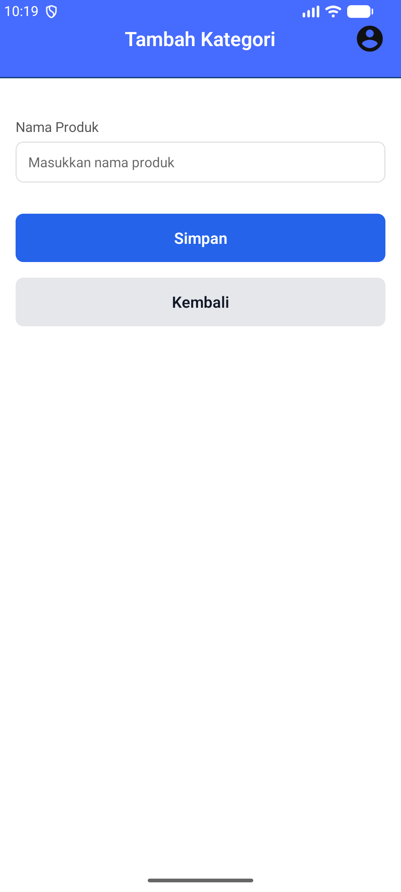
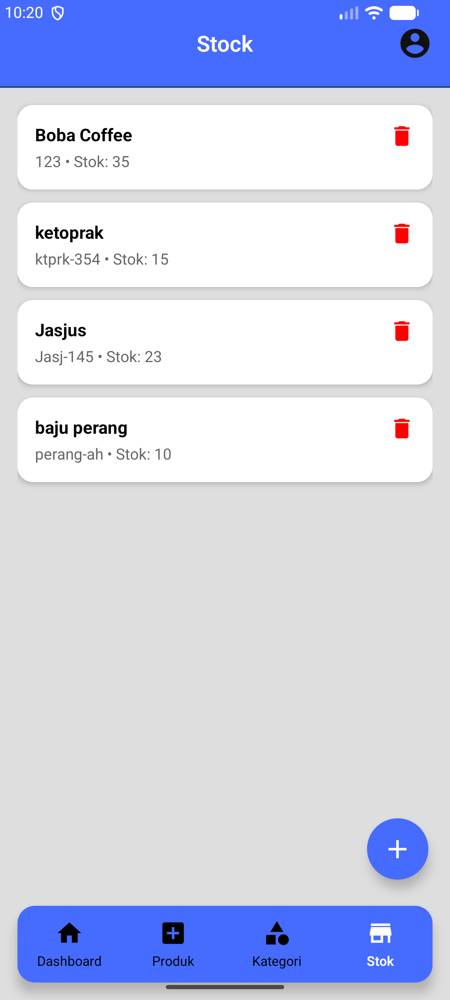
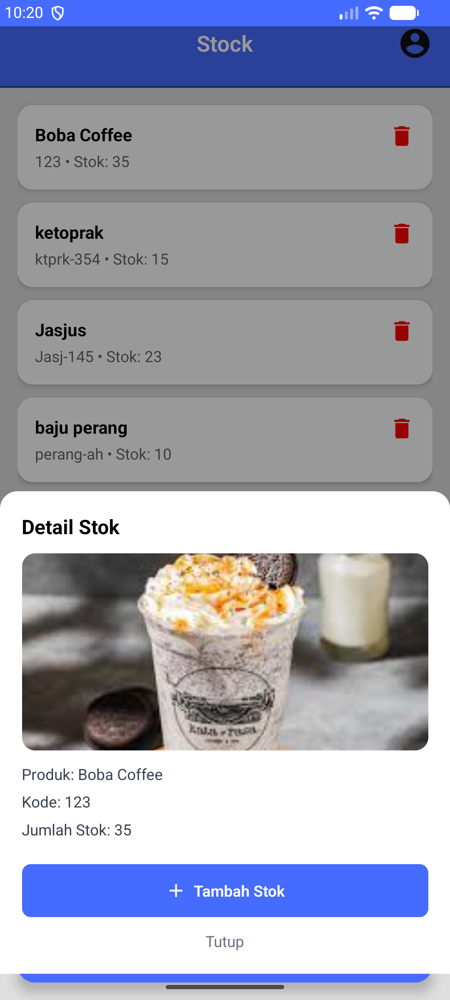
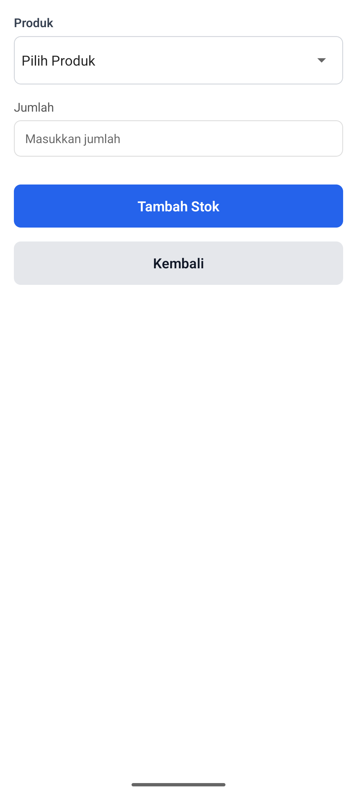

# Product Management App

Aplikasi mobile berbasis **React Native CLI** untuk mengelola **produk, kategori, dan stok**.  
Aplikasi ini mendukung CRUD data, pengelolaan stok, serta autentikasi berbasis token.

---

## Fitur Utama
- Manajemen Produk (Tambah, Edit, Hapus)
- Manajemen Kategori
- Manajemen Stok Produk
- Upload & preview gambar produk
- Dashboard ringkasan (Produk, Kategori, Stok)
- Navigasi Bottom Tab
- Reusable Component (Button, Input, Navbar)
- Autentikasi Token (Async Storage)

---

## Teknologi yang Digunakan
- **React Native CLI**
- **TypeScript**
- **React Navigation**
- **Axios**
- **Async Storage**
- **React Native Vector Icons**
- **React Native Image Picker**
- **Android SDK**

---

## Hasil Output Aplikasi

### Splash Screen


### Login Screen


### Dashboard


### Product Screen




### Kategori Screen



### Stock Screen




### Profile Screen

---

## 🚀 Cara Instalasi & Menjalankan Aplikasi

### 1️⃣ Prasyarat
Pastikan sudah terinstall di komputer:
- **Node.js** (disarankan versi LTS / ≥ v20)
- **npm** atau **yarn**
- **React Native CLI**
- **Android Studio**
- **Android SDK & Emulator** atau device Android fisik

Cek instalasi:
```bash
node -v
npm -v
react-native --version

1. Install Dependencies
npm install
atau
yarn install

2 Jalankan Metro Bundler
npx react-native start
Biarkan terminal ini tetap berjalan

3 Jalankan Aplikasi Android

Buka terminal baru:

npx react-native run-android


Pastikan:

Emulator Android sudah berjalan, atau

Device fisik sudah terhubung dengan USB Debugging aktif

4 Jika Terjadi Error / Crash (Opsional)
npx react-native start --reset-cache
cd android
./gradlew clean
cd ..
npx react-native run-android